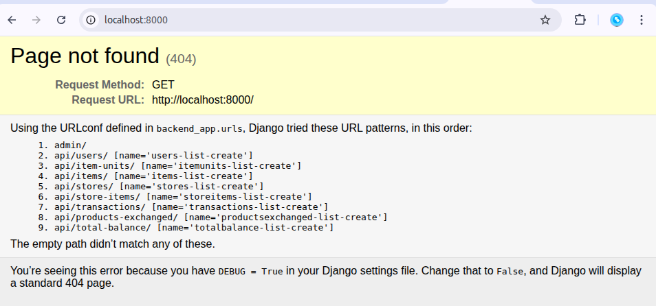

# ITU ShopEasy API

Frontend Repo: [https://github.com/sfidan42/ITU_ShopEasy_APP](https://github.com/sfidan42/ITU_ShopEasy_APP)

## Setup
1. Install Docker Compose
2. Run `make` 
3. Then run the application in frontend repo. (frontend repo might use localhost, so one might need to modify URL field later)

## API URLS

